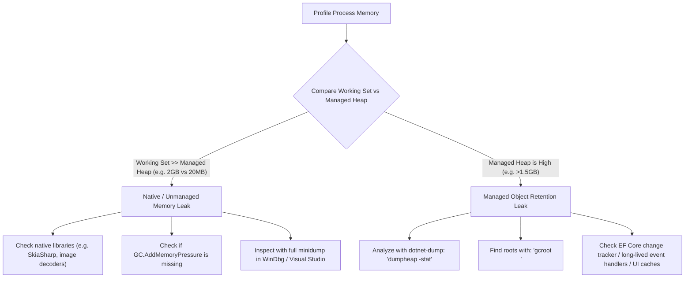

# .NET Memory Diagnostics & Leak Profiling Skill

This skill provides a complete methodology and reusable code patterns to diagnose and debug high RAM usage, memory spikes, and leaks in .NET applications on Windows.

## 1. Core Diagnostic Methodology

When troubleshooting high memory usage in .NET, the first step is determining whether the leak is **Managed** (.NET GC heap) or **Native / Unmanaged** (C++ libraries, SkiaSharp, direct memory allocations, CRT heap):



| Memory Area | Metric | What It Means |
| :--- | :--- | :--- |
| **Working Set** | `Process.WorkingSet64` | Total physical RAM currently occupied by the process. |
| **Private Memory** | `Process.PrivateMemorySize64` | Total committed virtual memory by the process (RAM + Pagefile). |
| **Managed Heap** | `GC.GetTotalMemory(false)` | Managed C# objects tracked by the .NET Garbage Collector. |
| **Native Unmanaged** | `WorkingSet64 - GC.GetTotalMemory()` | C++ libraries (Skia, SQLite), unmanaged allocators, thread stacks. |

---

## 2. Automated Memory Dump Capture (P/Invoke)

Use `DbgHelp.dll`'s `MiniDumpWriteDump` to automatically capture a full crash/memory dump when RAM reaches a designated threshold (e.g., 2.0 GB).

```csharp
using System.Diagnostics;
using System.Runtime.InteropServices;
using Microsoft.Win32.SafeHandles;

public static class MemoryDumpWriter
{
    [Flags]
    public enum MiniDumpType : uint
    {
        MiniDumpNormal = 0x00000000,
        MiniDumpWithFullMemory = 0x00000002,
        MiniDumpWithHandleData = 0x00000004,
        MiniDumpWithUnloadedModules = 0x00000020,
        MiniDumpWithThreadInfo = 0x00001000
    }

    [DllImport("Dbghelp.dll", SetLastError = true, CallingConvention = CallingConvention.Winapi)]
    private static extern bool MiniDumpWriteDump(
        IntPtr hProcess,
        uint processId,
        SafeFileHandle hFile,
        uint dumpType,
        IntPtr expParam,
        IntPtr userStreamParam,
        IntPtr callbackParam);

    public static (bool Success, string? Error, long SizeBytes) CaptureFullDump(string filePath)
    {
        if (!RuntimeInformation.IsOSPlatform(OSPlatform.Windows))
            return (false, "Only supported on Windows.", 0);

        try
        {
            var dir = Path.GetDirectoryName(filePath);
            if (!string.IsNullOrEmpty(dir)) Directory.CreateDirectory(dir);

            using var process = Process.GetCurrentProcess();
            using var fileStream = new FileStream(filePath, FileMode.Create, FileAccess.ReadWrite, FileShare.None);

            var dumpType = (uint)(MiniDumpType.MiniDumpWithFullMemory 
                                | MiniDumpType.MiniDumpWithHandleData 
                                | MiniDumpType.MiniDumpWithThreadInfo 
                                | MiniDumpType.MiniDumpWithUnloadedModules);

            bool success = MiniDumpWriteDump(
                process.Handle,
                (uint)process.Id,
                fileStream.SafeFileHandle,
                dumpType,
                IntPtr.Zero, IntPtr.Zero, IntPtr.Zero);

            if (!success)
            {
                var err = Marshal.GetLastWin32Error();
                return (false, $"Win32 Error: {err}", 0);
            }

            fileStream.Flush();
            return (true, null, fileStream.Length);
        }
        catch (Exception ex)
        {
            return (false, ex.Message, 0);
        }
    }
}
```

---

## 3. Real-Time Memory Monitor Pattern

Run a lightweight background loop (500ms) to track memory usage and trigger a dump automatically:

```csharp
public class MemoryMonitor : IAsyncDisposable
{
    private readonly double thresholdMb;
    private readonly CancellationTokenSource cts = new();
    private readonly Task monitorTask;
    private double nextThresholdMb;

    public MemoryMonitor(double thresholdGb = 2.0, int intervalMs = 500)
    {
        this.thresholdMb = thresholdGb * 1024.0;
        this.nextThresholdMb = this.thresholdMb;
        this.monitorTask = Task.Run(() => Loop(intervalMs, cts.Token));
    }

    private async Task Loop(int intervalMs, CancellationToken ct)
    {
        while (!ct.IsCancellationRequested)
        {
            using var p = Process.GetCurrentProcess();
            var wsMb = p.WorkingSet64 / (1024.0 * 1024.0);
            var heapMb = GC.GetTotalMemory(false) / (1024.0 * 1024.0);

            if (wsMb >= nextThresholdMb)
            {
                nextThresholdMb += 1024.0; // +1GB for subsequent dumps
                var dumpFile = $"dump_{DateTime.Now:yyyyMMdd_HHmmss}_{wsMb:F0}MB.dmp";
                MemoryDumpWriter.CaptureFullDump(dumpFile);
            }
            await Task.Delay(intervalMs, ct);
        }
    }

    public async ValueTask DisposeAsync()
    {
        cts.Cancel();
        await monitorTask.WaitAsync(TimeSpan.FromSeconds(2));
        cts.Dispose();
    }
}
```

---

## 4. SkiaSharp / Image Processing Memory Best Practices

When handling bulk image decodes (e.g. 4K/8K images):

1. **Use `SKCodec` for Downscaling**:
   `SKBitmap.Decode()` uncompresses the full raw pixel buffer (8192×4096 = 134 MB RAM) even if downscaling to a 400px thumb.
   Instead, use `SKCodec.Create()` with `codec.GetScaledDimensions(scale)` to decode directly at the target sub-scale.
2. **Single-Pass Multi-Variant Generation**:
   If both a thumbnail (400px) and a full image (2560px) are needed, decode once into memory, encode the full WebP, downscale the in-memory bitmap, and encode the thumbnail WebP.
3. **Report Native Memory Pressure**:
   Always call `GC.AddMemoryPressure(width * height * 4)` and `GC.RemoveMemoryPressure(...)` in a `finally` block so the .NET runtime is aware of unmanaged native allocations.
4. **Cap Full-Image Dimensions**:
   Cap full-resolution caches (e.g., 2560px max edge at Quality 82) to avoid storing unneeded 8K bitmaps while maintaining 4K/retina visual quality.

---

## 5. Analyzing Dumps with `dotnet-dump`

```text
# Analyze the dump file
dotnet-dump analyze <path-to-dump.dmp>

# Inside the dotnet-dump prompt:
> dumpheap -stat          # View object counts and heap breakdown
> dumpheap -min 100000    # Find all objects > 100KB
> gcroot <address>        # Find what references a leaked object
> clrthreads              # List active threads and stacks
> exit
```

For detailed code templates and complete class implementations, see [code-templates.md](./references/code-templates.md).
