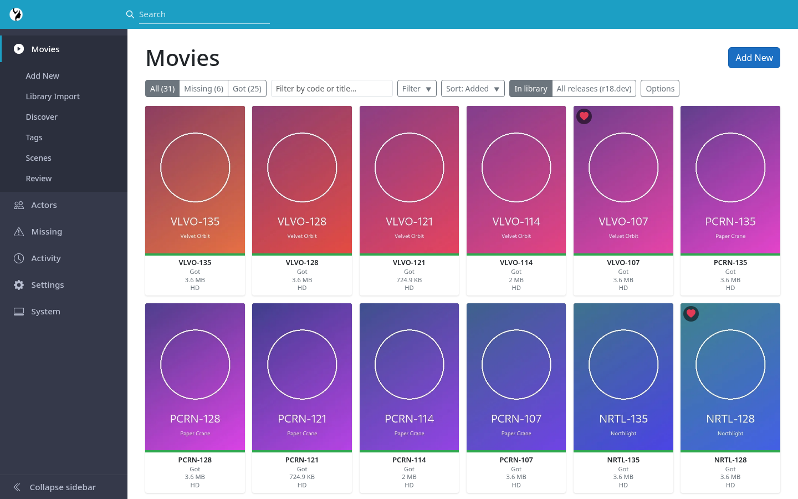
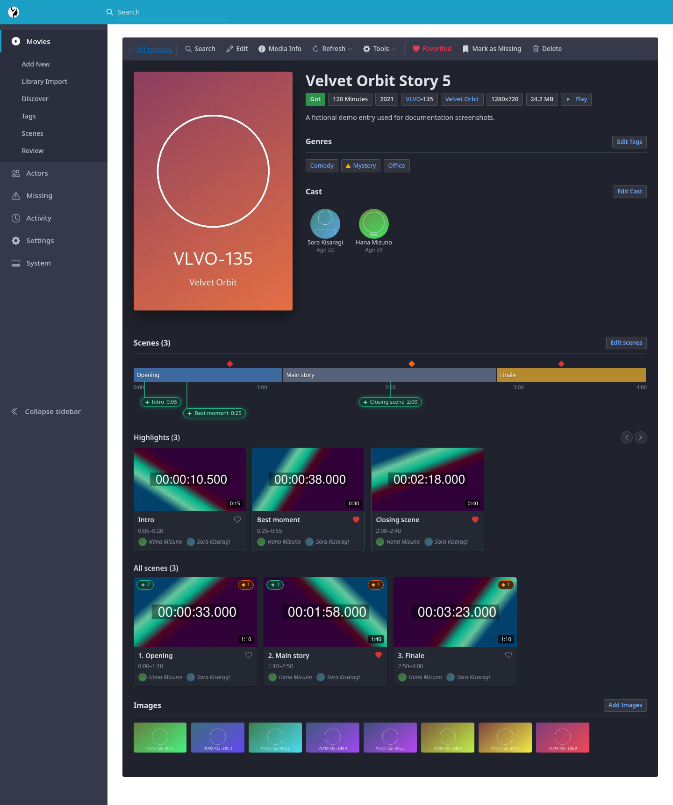

# Javbuddy

Javbuddy is a self-hosted manager for JAV collections, modeled on Sonarr/Radarr: track the movies you want and the ones you own, pull metadata from javinizer-go, grab releases through Prowlarr and qBittorrent, organize finished downloads into your library, and watch them in the built-in player. See the [screenshots](docs/screenshots.md) for a look at the UI.





## Disclaimers

- **AI disclosure.** This project was created 100% with AI.
- **Adult content.** Javbuddy manages collections of adult videos and pulls metadata and cover images from adult-content sources. It is for adults only and ships no media. You are responsible for what you add to your library and for following the law where you live. Download only what you are allowed to.
- **No authentication.** Javbuddy has no login of its own. Run it on a network you trust, or put it behind a reverse proxy that adds authentication, such as basic auth or an OIDC proxy.
- **Docker only.** Docker is the only supported way to run it. Anything else, including native hosting on Windows or macOS, is best effort.
- **Browser support.** It has been tested only on Chromium on desktop.

## Features

### Library & browsing
- **Movies** grid with Missing / Downloading / Got status badges, search, faceted filters (resolution, codec, studio, label, genre, cast attributes, `.nfo` drift) and sorting.
- **Add New** (`/add/new`) adds a movie by its code and fetches its metadata. **Library Import** (`/add/import`) scans folders already on disk and imports what it finds, so an existing collection becomes tracked in one pass.
- **Movie detail**: edit metadata, crop the cover, edit cast and tags, see media info, keep several file versions of one movie, and view or edit the `.nfo` and resolve conflicts between it and the database. VR / 3D format is detected from file names and can be overridden.
- **Review** (`/movies/review`) walks the library one movie at a time in a player, so you can decide fast: mark it reviewed and move on, snooze it for 90 days or blacklist it. A related **Cleanup** mode adds deleting a movie and its folder.
- **Discover** (`/movies/discover`) scans studio sites for new and upcoming releases, grouped by studio with the credited actresses matched to the ones you track. Add a candidate to your wanted list in one click. A scan runs weekly, or on demand with **Scan Now**, and each source can be switched off in settings.
- **Missing** lists every tracked movie you don't own yet.
- **Tags**: a tag library with replacement and ignore rules, and a review rail for tags that appear for the first time.
- **Statistics** (`/system/statistics`): library overview with status, resolution and codec breakdowns, movies added per month, and top actors and tags.

### Playback, scenes & highlights
- A built-in browser player streams straight from your library files, so you don't need a media server to watch.
- Scrub-bar trickplay previews are generated locally, or taken from Jellyfin when available.
- Mark **scenes** (non-overlapping chapters of a movie), tag the performers in each and write them back to the file as chapters.
- Mark **highlights** (favorite clips with their own performers and tags) and **apexes** (single favorite moments). Tags roll up from clips to scenes and the movie, and actors are inherited downwards. The rules are in [Scenes, highlights and apexes](docs/scenes-and-apexes.md).
- The **Scenes** wall (`/movies/scenes`) shows clips from the whole library, filterable by actor and tag, with Play all and Shuffle.
- **VR 2D** unwarps side-by-side 180° equirectangular or fisheye video into a flat view you can drag around, for watching VR releases without a headset.
- Optional **DeoVR** support (off by default): browse and play your movies in the DeoVR player, with every version as a source, scenes as chapters, and your own filtered and sorted lists (**Settings > DeoVR**).

### Actors
- A tracked actor directory with profile data (birth date, height, measurements) from javinizer-go, r18.dev, WAPdB and minnano-av.
- Per-actor **Missing** releases from their r18.dev filmography that aren't in your library, with one-click search and add.
- Photo galleries with albums, batch upload and portrait promotion. Merge duplicate actors, and keep aliases.

### Downloads & import
- Search Prowlarr indexers and send a torrent to qBittorrent from any movie or release.
- **Activity** shows the live download queue and history, with an active-download count in the sidebar.
- **Torrent sort** is a wizard for a finished download: it identifies the movie codes in it, scrapes their metadata through javinizer-go, lets you review posters and screenshots, then renames and moves the files into your library. Multi-part VR videos can be merged into one file first, and the download can be cleaned up from qBittorrent at the end.

### System
- **Status**: integration health checks and disk space.
- **Tasks**: scheduled background jobs (library rescan, image cache, Jellyfin link sync, qBittorrent sync, movie discovery, r18.dev import, trickplay backfill) with run-now and history.

## Integrations

| Service | Used for | Required |
|---|---|---|
| [javinizer-go](https://github.com/javinizer/javinizer-go) | Movie and actor metadata, cover images | Yes |
| [Prowlarr](https://prowlarr.com/) | Torrent search | For downloads |
| [qBittorrent](https://www.qbittorrent.org/) | Downloading | For downloads |
| [Jellyfin](https://jellyfin.org/) | Ownership/link sync, "Open in Jellyfin", trickplay fallback | No |
| [DeoVR](https://deovr.com/) | Browsing and playing movies in VR through its JSON API | No (off by default) |
| r18.dev dump | Release catalog, actor filmographies (imported locally) | No |
| WAPdB | Extra actor profile data | No |
| FFmpeg / MediaInfo | Media probing, trickplay, clip previews, VR merge (bundled in the Docker image) | Bundled |

## Getting started

### Docker Compose

Create a `docker-compose.yml`:

```yaml
services:
  javbuddy:
    image: ghcr.io/javbuddy/javbuddy:latest
    ports:
      - "8080:8080"
    environment:
      LocalLibrary__RootPaths__0: /media
    volumes:
      - ./data:/data        # SQLite database + key ring — needs reliable file locking (not NFS)
      - ./cache:/cache      # Regenerable image cache — fast disk, safe to lose
      - ./objects:/objects  # Actor photos and trickplay — bulk storage, NFS is fine
      - /path/to/your/library:/media
    restart: unless-stopped
```

```bash
docker compose up -d
```

Open <http://localhost:8080>. Javbuddy needs javinizer-go, and Prowlarr and qBittorrent for downloads. **[docs/getting-started.md](docs/getting-started.md)** walks through deploying them and the first run end to end.

Integrations can be configured in the UI or through environment variables (which then lock the UI field). Every setting, the path-mapping options for when Javbuddy, javinizer-go and qBittorrent see your files under different paths, and a Kubernetes example are in **[docs/configuration.md](docs/configuration.md)**.

### First run

The short version (see [Getting started](docs/getting-started.md) for the full walkthrough):

1. **Settings → Connections** (`/settings/connections`): enter javinizer-go, and optionally Prowlarr, qBittorrent and Jellyfin, then test each connection.
2. **Settings → Metadata** (`/settings/metadata`): check your library folders and enable the optional metadata sources (r18.dev, WAPdB).
3. Bring in your collection with **Movies → Library Import** (`/add/import`), or start a wanted list with **Movies → Add New** (`/add/new`).
4. **System → Tasks** (`/system/tasks`): review the schedules and run the first library rescan / image cache / r18.dev import now instead of waiting.

### Running from source

Clone the repository (`git clone https://github.com/javbuddy/javbuddy.git`). Requires the .NET 11 SDK, plus `ffmpeg` and `ffprobe` on the `PATH` (or `Ffmpeg__Path` / `Ffmpeg__ProbePath`) for trickplay, previews and VR merge.

```bash
dotnet run --project Javbuddy
```

## Tech stack

- .NET 11 Blazor Server (interactive server rendering over SignalR)
- EF Core with SQLite
- FFmpeg and MediaInfo for media work; WebGL for the VR viewer
- Docker image with FFmpeg bundled

## Documentation

- [Getting started](docs/getting-started.md) — deploy javinizer-go, Prowlarr and qBittorrent, and the first run end to end
- [Library guide](docs/library-guide.md) — folder layout, importing an existing collection, Torrent sort, path mappings
- [Configuration reference](docs/configuration.md) — every setting, storage tiers, Compose and Kubernetes examples
- [Local library format](docs/local-library-format.md) — folder layout, `.nfo` dialects, `.actors/`
- [Jellyfin integration](docs/jellyfin-integration.md) — ownership sync, linking, library selection
- [Screenshots](docs/screenshots.md) — the main pages, shown with a fictional demo library
- [Credits & inspirations](docs/credits.md) — the projects and data sources Javbuddy builds on

For contributors (see also [CONTRIBUTING](CONTRIBUTING.md) and the [security policy](SECURITY.md)):

- [Architecture](docs/architecture.md) — layering rules and why
- [Codebase map](docs/codebase-map.md) — where each page, service and test lives
- [Scenes, highlights and apexes](docs/scenes-and-apexes.md) — how they relate, tag propagation and actor assignment
- [Database workflow](docs/database-workflow.md) — EF Core migrations and the database roadmap
- [Feature workflow](docs/feature-workflow.md) — request → plan → implement → verify, and git hygiene
- [UI guidelines](docs/ui-guidelines.md) — the Sonarr-style patterns to follow
- Issues and backlog: [GitHub issues](https://github.com/javbuddy/javbuddy/issues)

## License

Javbuddy is released under the [MIT License](LICENSE).

The studio logos in `Javbuddy/wwwroot/studio-logos/` are trademarks of their respective owners. They are included only to identify studios in the UI and are not covered by the MIT License.
